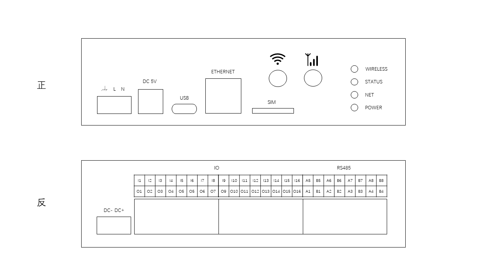

<div align="center"> 
<h1>通用控制器</h1>
</div>

## 介绍

这是一款可以解决绝大部分常见自动化控制、传感检测等需求的物联网通用控制器。可替代 PLC 甚至完成 PLC 无能完成的任务，通过在线编程和在线组态的方式实现灵活的超高自由度管理。开发者无需赶赴现场，即可在线编写与修改业务逻辑。轻松应对各种工业、农业需求。

### 特性

-   **电源**： 可直接`220V交流`供电，或`5V电源适配器`供电，可接`开路电压5V~16V太阳能板`，可内置`3.7V锂电池`。具有动态电源管理功能，当外部电源掉电，内置锂电池可保证系统继续工作超过 48 小时
-   **网络**： 支持`以太网`，`4G`，`WIFI`3 种联网方式
-   **性能**： CPU:`180MHz`，RAM:`32MB`，FLASH:`16MB`
-   **IO**： 16 组隔离 IO，每组由一个 IN 一个 OUT 组成，OUT 由 PMOS 驱动，IN 与 OUT 存在线与逻辑，当 IN 脚输入为低时，OUT 强制输出低，此特性可用于各种电机控制中的限位开关安全保证。IN 脚含上拉电阻，兼容 NPN 型输入信号
-   **通讯**： 8 组`隔离RS485`
-   **固件在线升级**
-   **在线编程**： 系统运行 LUA 脚本引擎，可以执行通过网络下发的即时指令。可以通过网络配置系统运行参数。可运行网络下发的动态 LUA 脚本。可以通过网络请求服务器的数据。可以跨节点（通过服务器）调取其他设备中的数据

### 引脚分配

<div align="center"> 
 
</div>

#### 正面

| 标识      | 描述                                                               |
| --------- | ------------------------------------------------------------------ |
| 地 L N    | AC 220V 供电，供电 3 选 1                                          |
| DC 5V     | DC 5V 适配器供电，供电 3 选 1                                      |
| USB       | USB type C 供电，供电 3 选 1，或上位机离线编程通讯接口（暂未实现） |
| ETHERNET  | 以太网联网，DHCP 自动获取 IP                                       |
| SIM       | SIM 卡插槽，三网兼容                                               |
| WIFI 符号 | WIFI SMA 天线接口                                                  |
| 基站符号  | 4G LTE SMA 天线接口                                                |

#### 反面

| 标识     | 描述                                                                                                                              |
| -------- | --------------------------------------------------------------------------------------------------------------------------------- |
| DC- DC+  | 5-24V 外部隔离电源，仅用于 IO 驱动                                                                                                |
| O1 ~ O16 | IO 输出，PMOS 驱动，可驱动继电器或小型直流电机                                                                                    |
| I1 ~ I16 | IO 输入，兼容 PNP 型输入，电平变化可触发软件回调；与 IO 输出口逻辑线与，Ix 低电平时将使 Ox 强制输出低电平，可用于无编程触发或限位 |
| Ax Bx    | 隔离 RS485 A B 端口                                                                                                               |

### 系统架构

硬件部署在工业现场以后，可以通过网页组态或在线编程的方式，使硬件能够完成任意业务功能，所有的物理接口都可以通过 LUA 编程语言动态调用，可以跨节点读取数据。

_适用场景举例：节点 A 部署在室内，IO 接一个继电器与限位器。节点 B 部署在室外，外接一个淘宝买的 RS485 温度传感器。在线编程使得节点 A 读取节点 B 的温湿度数据，一旦触发条件则启动继电器，并且通过限位器或微动开关保障电机运行安全。当然，让单个节点自身完成复杂逻辑业务更是易如反掌。因此，硬件的物理接口种类和数量越多，通用性就越高。服务器还能够支持更多高级功能，例如报表查看，数据下载，日志查看，编程自定义报警等。_

<div align="center"> 
 
</div>

### 名词解释

-   **控制面板**： 包含多个`节点`，是`节点`所属的一个"集合"，负责管理`节点`
-   **节点**： 一个虚拟的、可操作的最小单位，`节点`实际由一个或多个`设备`（通用控制器）组成，`属性`均位于节点上
-   **设备**： 即通用控制器，在线编程均在`设备`中完成
-   **属性**： 即控件，类型分为`参数`、`开关`、`按钮`，当`属性`允许操作时，需编写`回调函数`，操作属性时`回调函数`将被执行

## 在线编程

### 属性名词解释

-   **属性名**： 纯英文唯一识别 id，用于区分同一个`节点`中的其他属性，在线编程也需要使用它
-   **属性显示名**： 任意字符，用于在 UI 上显示友好的名称
-   **面板展示**： 属性是否在`控制面板`中显示，若否则需打开`节点`才能看到
-   **数据持久化**： 属性值被更新时是否持久化，用于图表展示及数据的下载与分析，注：仅对能被解析为数字的值有效
-   **允许操作**： 属性值是否可以被操作
-   **操作回调**： 当属性允许被操作时，需要编写操作回调函数，用于控制操作的具体业务逻辑

### 属性回调函数

回调函数必须符合以下形式

```lua
function callback(value)
  --Do something here, return true when succeed
  return false
end
```

当属性被操作时，例如：类型为`参数`的属性被修改时，value 的值即为所填参数；类型为`开关`的属性被操作时，value 的值将为'true'或'false'。注：value 一定是字符串。<br/> callback 函数返回 true 时操作成功，`节点`属性将被更新；返回 false 时操作失败，`节点`属性保持原装。<br/> 开发者需要在回调函数中编写业务逻辑，如 进行数据的运算、向`设备`下发数据或通知、修改其他`属性`等。具体操作请参考`函数库`章节

### 设备脚本库

在设备管理面板中可编写脚本，每一个文件都是一个独立线程，每个脚本可停止或启动，当修改脚本后，需要重新启动该脚本才会生效。 <br/> 开发者可在脚本中编写业务逻辑，如 读写 RS485 从机、进行数据运算、修改`节点`的`属性`值、调用同`节点`下的其他`设备`中的函数（跨设备联动）等。具体操作请参考`函数库`章节
