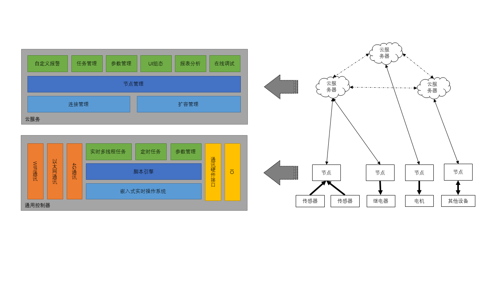
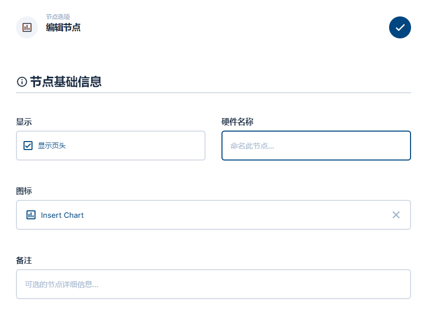
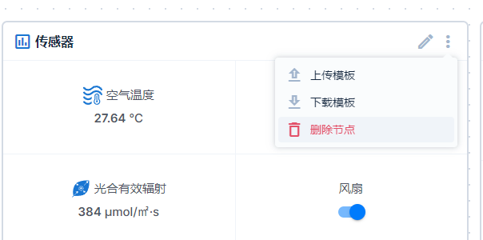

<div align="center"> 
<h1>通用控制器</h1>
</div>

## 介绍

这是一款可以解决绝大部分常见自动化控制、传感检测等需求的物联网通用控制器。可替代 PLC 甚至完成 PLC 无能完成的任务，通过在线编程和在线组态的方式实现灵活的超高自由度管理。开发者无需赶赴现场，即可在线编写与修改业务逻辑。轻松应对各种工业、农业需求。

### 特性

-   **电源**： 可直接`220V交流`供电，或`5V电源适配器`供电，可接`开路电压5V~16V太阳能板`，可内置`3.7V锂电池`。具有动态电源管理功能，当外部电源掉电，内置锂电池可保证系统继续工作超过 48 小时
-   **网络**： 支持`以太网`，`4G`，`WIFI`3 种联网方式
-   **性能**： CPU:`180MHz`，RAM:`32MB`，FLASH:`16MB`
-   **IO**： 16 组隔离 IO，每组由一个 IN 一个 OUT 组成，OUT 由 PMOS 驱动，IN 与 OUT 存在线与逻辑，当 IN 脚输入为低时，OUT 强制输出低，此特性可用于各种电机控制中的限位开关安全保证。IN 脚含上拉电阻，兼容 NPN 型输入信号
-   **通讯**： 8 组`隔离RS485`
-   **固件在线升级**
-   **在线编程**： 系统运行 LUA 脚本引擎，可以执行通过网络下发的即时指令。可以通过网络配置系统运行参数。可运行网络下发的动态 LUA 脚本。可以通过网络请求服务器的数据。可以跨节点（通过服务器）调取其他设备中的数据

### 引脚分配

<div align="center"> 
 
</div>

#### 正面

| 标识      | 描述                                                               |
| --------- | ------------------------------------------------------------------ |
| 地 L N    | AC 220V 供电，供电 3 选 1                                          |
| DC 5V     | DC 5V 适配器供电，供电 3 选 1                                      |
| USB       | USB type C 供电，供电 3 选 1，或上位机离线编程通讯接口（暂未实现） |
| ETHERNET  | 以太网联网，DHCP 自动获取 IP                                       |
| SIM       | SIM 卡插槽，三网兼容                                               |
| WIFI 符号 | WIFI SMA 天线接口                                                  |
| 基站符号  | 4G LTE SMA 天线接口                                                |

#### 反面

| 标识     | 描述                                                                                                                              |
| -------- | --------------------------------------------------------------------------------------------------------------------------------- |
| DC- DC+  | 5-24V 外部隔离电源，仅用于 IO 驱动                                                                                                |
| O1 ~ O16 | IO 输出，PMOS 驱动，可驱动继电器或小型直流电机                                                                                    |
| I1 ~ I16 | IO 输入，兼容 PNP 型输入，电平变化可触发软件回调；与 IO 输出口逻辑线与，Ix 低电平时将使 Ox 强制输出低电平，可用于无编程触发或限位 |
| Ax Bx    | 隔离 RS485 A B 端口                                                                                                               |

### 系统架构

硬件部署在工业现场以后，可以通过网页组态或在线编程的方式，使硬件能够完成任意业务功能，所有的物理接口都可以通过 LUA 编程语言动态调用，可以跨节点读取数据。

_适用场景举例：节点 A 部署在室内，IO 接一个继电器与限位器。节点 B 部署在室外，外接一个淘宝买的 RS485 温度传感器。在线编程使得节点 A 读取节点 B 的温湿度数据，一旦触发条件则启动继电器，并且通过限位器或微动开关保障电机运行安全。当然，让单个节点自身完成复杂逻辑业务更是易如反掌。因此，硬件的物理接口种类和数量越多，通用性就越高。服务器还能够支持更多高级功能，例如报表查看，数据下载，日志查看，编程自定义报警等。_

<div align="center"> 
 
</div>

### 名词解释

-   **控制面板**： 包含多个`节点`，是`节点`所属的一个"集合"，负责管理`节点`
-   **节点**： 一个虚拟的、可操作的最小单位，`节点`实际由一个或多个`设备`（通用控制器）组成，`属性`均位于节点上
-   **设备**： 即通用控制器，在线编程均在`设备`中完成
-   **属性**： 即控件，类型分为`参数`、`开关`、`按钮`，当`属性`允许操作时，需编写`回调函数`，操作属性时`回调函数`将被执行

## 节点管理

### 编辑节点
<div style="display:flex;justify-content:center;align-items:center"> 
 
 
 
 
</div>

-   **下载模板**： 可将当前节点的配置信息下载作为模板
-   **上传模板**： 可将模板上传，一键配置节点，用于批量复制

### 编辑节点属性

<div style="display:flex;justify-content:center;align-items:center"> 
 
 
 
</div>

-   **属性名**： 纯英文唯一识别 id，用于区分同一个`节点`中的其他属性，在线编程需要使用它
-   **属性显示名**： 任意字符，用于在 UI 上显示友好的名称
-   **组件类型**： `开关`或`参数`
-   **单位**： 用于UI友好显示
-   **面板展示**： 属性是否在`控制面板`中显示，若否则需展开`节点`才能看到
-   **数据持久化**： 属性值被更新时是否持久化，用于图表展示及数据的下载与分析，注：仅对能被解析为数字的值有效
-   **允许操作**： 属性值是否可以被操作
-   **操作回调**： 当属性允许被操作时，需要编写操作回调函数，用于控制操作的具体业务逻辑

### 属性回调函数

回调函数签名必须为 ``` function callback(value)``` </br>例：

```lua
function callback(value)
  --调用'device'的设备中'main'脚本中的'setIO'方法，传入参数value，超时时间5S
  --调用成功则返回true，否则返回false, 
  --第二个返回值为setIO的返回值
  local ret,data = device.invoke('device','main','setIO',value,5000)
  return ret
end
```

当属性被操作时，例如：类型为`参数`的属性被修改时，value 的值即为所填参数；类型为`开关`的属性被操作时，value 的值将为'true'或'false'。注：value 一定是字符串。<br/> callback 函数返回 true 时操作成功，`节点`属性将被更新；返回 false 时操作失败，`节点`属性保持原装。<br/> 开发者需要在回调函数中编写业务逻辑，如 进行数据的运算、向`设备`下发数据或通知、修改其他`属性`等。具体操作请参考`函数库`章节

### 设备编程

<div style="display:flex;justify-content:center;align-items:center"> 
 
</div>

在设备管理面板中可为设备编写脚本，每一个文件都是一个独立线程，每个脚本可停止或启动，当修改脚本后，需要重新启动该脚本才会生效。注：设备的状态不会随着脚本的重启而改变，例如IO可能会维持在上一个脚本所控制的输出状态。 <br/> 开发者可在脚本中编写业务逻辑，如 读写 RS485 从机、进行数据运算、修改`节点`的`属性`值、调用同`节点`下的其他`设备`中的函数（跨设备联动）等。具体操作请参考`函数库`章节
<div style="display:flex;justify-content:center;align-items:center"> 
 
</div>

## 函数库

### lua内置函数库
[更多使用方法可查阅Lua官方文档](https://www.lua.org/manual/5.4)

```lua
print

os.clock
os.date
os.difftime
os.time

string.byte
string.char
string.dump
string.find
string.format
string.gmatch
string.gsub
string.len
string.lower
string.match
string.rep
string.reverse
string.sub
string.upper
string.pack
string.packsize
string.unpack

math.abs
math.acos
math.asin
math.atan
math.ceil
math.cos
math.deg
math.exp
math.tointeger
math.floor
math.fmod
math.ult
math.log
math.max
math.min
math.modf
math.rad
math.sin
math.sqrt
math.tan
math.type
math.random
math.randomseed
math.pi
math.huge
math.maxinteger
math.mininteger
```

### 扩展函数包 ```cache```

#### ```cache.set(key,obj)```
将变量存到全局缓存，可用于跨脚本传递变量，注：普通变量无法跨脚本使用
</br>示例:

```lua
local obj = {a=1,b='hello'}
cache.set('table',obj)
```

#### ```cache.get(key)```
从全局缓存取变量，可用于跨脚本传递变量，注：普通变量无法跨脚本使用
</br>示例:

```lua
local obj = cache.get('table')
-- obj = {a=1,b='hello'}
```

### 扩展函数包 ```io```

#### ```io.write(port,on)```
控制Output引脚输出电平， port取值范围1-16，on取值范围[0,1]
</br>示例:

```lua
--依次翻转16路Ouput电平
for i=1,16 do
  io.write(i,1)
  system.sleep(500)
  io.write(i,0)
  system.sleep(500)
end
```

#### ```io.read(port)```
读取Input引脚电平
</br>示例:

```lua
--若检测到1号Input（按钮、微动开关）低电平，则将1号Output输出为低电平（关闭继电器）
while(true) do
  if(io.read(1)==0) then
    io.write(1,0)
  end
end
```

### 扩展函数包 ```system```

#### ```system.sleep(milliseconds)```
当前脚本延时固定毫秒数。注：不影响其他脚本的执行。
</br>示例:

```lua
--1号Output输出周期为1s的方波
while(true) do
  io.write(1,1)
  system.sleep(500)
  io.write(1,0)
  system.sleep(500)
end
```

#### ```system.waitRTCInit()```
等待服务器授时成功。由于设备自身没有初始时间，而存储的脚本一上电就会执行。所以如果脚本中需要使用定时任务，需要先等待服务器授时成功。否则定时将不符合预期

#### ```system.scheduleJob(cronExp,jobFun)```
注册定时任务，cronExp为[cron表达式](https://www.matools.com/cron)，jobFun为需要被执行的函数
</br>示例:

```lua
--脚本的第一行，先等待授时成功
system.waitRTCInit()

function job1()
  print('I am job1')
end

function job2()
  print('I am job2')
end

system.scheduleJob('* * * * * *',job1)    -- 每秒执行一次job1
system.scheduleJob('0 30 8 * * *',job1)   -- 每天早上8:30分执行一次job2
```

#### ```system.getParameter(key)```

在平台中配置参数，点击立即下发后参数将被固化到设备中，通过调用此函数，可从设备中获取指定参数

<div style="display:flex;justify-content:center;align-items:center"> 
 
</div>

</br>示例:

```lua
local thresholdValue = system.getParameter('threshold')
if(someValue > thresholdValue) then
  --do something
end
```

### 扩展函数包 ```node```

#### ```node.setProperty(key,value,timeout)```
设置面板属性中控件的值
</br>示例:

```lua
node.setProperty('temperture','12.34')  -- 节点属性显示温度12.34
node.setProperty('switch','true')       -- 节点属性开关显示为开
```

#### ```node.queryData(query,timeout)```
设置面板属性中控件的值，query为influxdb查询语句,详细语法可参阅[官方文档](https://docs.influxdata.com/influxdb/v2.0/query-data/flux/)
</br>示例:

```lua
--获取当前时间戳
local now_timestamp = os.time()
--拼接查询语句
local query = string.format([[
    |> range(start:%d)
    |> filter(fn: (r) => r.propertyName == "light")
    |> integral(unit:1m)
    ]], now_timestamp - 10*60*1000)

--通过服务器求取10分钟前至现在所有light值的积分  
local ret,data = node.queryData(query,5000)
print(data[1][1]._value)
```

### 扩展函数包 ```device```

#### ```device.invoke(deviceAlias,scriptName,functionName,param,timeout)```
调用其他节点的方法，deviceAlias为指定设备的别名，scriptName为脚本名，functionName为方法名，param为传入参数，timeout超时毫秒数
</br>若远程节点的目标方法有返回值，则```device.invoke```的第二个返回值则为目标方法的返回值
</br>示例:

```lua
--节点A中main脚本
function sayHello(value)
  print(value..' say hello')
  return 'A'
end
```
```lua
--节点B中main脚本
let ret,data = device.invoke('deviceA','main','sayHello','B',5000)
if(ret) then
  print(data..' reply hello')
end
```

### 扩展函数包 ```modbus```

#### ```modbus.send(channel, baudrate, txTable, rxSize, timeout)```
使用RS485接口发送modbus指令，channel为通道号1-8，baudrate为波特率，txTable为发送的byte数组（不含2byte CRC），rxSize为期望接收的byte长度（不含2byte CRC），timeout超时毫秒数
</br>示例:

```lua
--拼凑将要发送的数据：总线地址02，功能码03，起始寄存器地址0x0000，读取1个寄存器
local command = {0x02 ,0x03 , 0x00,0x00 , 0x00, 0x01}
--发送modbus指令，使用端口号1，波特率9600，预期接受5个byte，超时500ms
--预期接收的数据应为{0x02, 0x03, 0x02, xx , xx}
local ret,data = modbus.send(1,9600,command,5,500)
local someValue = 0
if(ret) then
  someValue = data[4] << 8 + data[5]
end
print(someValue)
```